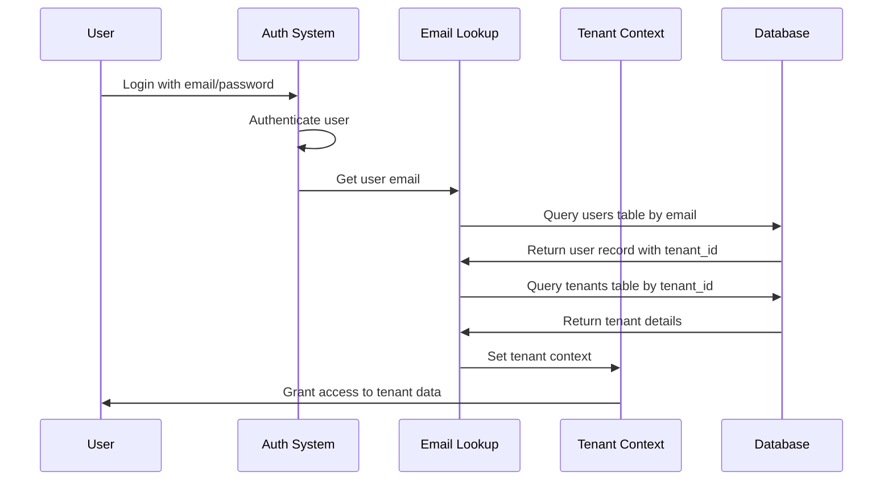

# Email-Based Tenant System Documentation

## Overview

This document outlines the email-based tenant system implementation for the School Management System. This approach provides secure, scalable multi-tenancy where users are automatically assigned to their appropriate tenant based on their email address rather than complex authentication flows.

## Table of Contents

1. [System Architecture](#system-architecture)
2. [Database Schema](#database-schema)
3. [Implementation Components](#implementation-components)
4. [Authentication Flow](#authentication-flow)
5. [Tenant Context Management](#tenant-context-management)
6. [Security Features](#security-features)
7. [Performance Optimizations](#performance-optimizations)
8. [API Reference](#api-reference)
9. [Troubleshooting](#troubleshooting)
10. [Best Practices](#best-practices)

## System Architecture

### Multi-Tenant Design Pattern

The system implements a **shared database, isolated data** pattern where:

- **Single Database**: All tenants share the same database instance
- **Tenant Isolation**: Data is isolated using `tenant_id` foreign keys
- **Email-Based Assignment**: Users are automatically mapped to tenants via email lookup
- **Context Propagation**: Tenant context flows through all queries and operations

```
┌─────────────────┐    ┌──────────────────┐    ┌─────────────────┐
│   User Login    │───▶│  Email Lookup    │───▶│  Tenant Context │
│                 │    │                  │    │                 │
│ kenj@school.com │    │ users table      │    │ Set tenant_id   │
└─────────────────┘    └──────────────────┘    └─────────────────┘
                                │
                                ▼
                    ┌──────────────────────────┐
                    │    All Database Queries  │
                    │  Automatically Filtered  │
                    │     by tenant_id        │
                    └──────────────────────────┘
```

## Database Schema

### Core Tables

#### Tenants Table
```sql
CREATE TABLE public.tenants (
  id uuid PRIMARY KEY DEFAULT gen_random_uuid(),
  name text NOT NULL,
  subdomain text UNIQUE,
  status text DEFAULT 'active' CHECK (status IN ('active', 'suspended', 'inactive')),
  contact_email text,
  contact_phone text,
  created_at timestamp with time zone DEFAULT CURRENT_TIMESTAMP
);
```

#### Users Table
```sql
CREATE TABLE public.users (
  id uuid PRIMARY KEY DEFAULT gen_random_uuid(),
  email text NOT NULL UNIQUE,
  full_name text NOT NULL,
  tenant_id uuid NOT NULL REFERENCES tenants(id),
  created_at timestamp without time zone DEFAULT CURRENT_TIMESTAMP
);
```

### Tenant-Aware Tables

All business logic tables include `tenant_id` for data isolation:

```sql
-- Example: Students table
CREATE TABLE public.students (
  id uuid PRIMARY KEY DEFAULT gen_random_uuid(),
  name text NOT NULL,
  email text,
  class_id uuid,
  tenant_id uuid NOT NULL REFERENCES tenants(id),
  created_at timestamp DEFAULT CURRENT_TIMESTAMP
);

-- Example: Classes table  
CREATE TABLE public.classes (
  id uuid PRIMARY KEY DEFAULT gen_random_uuid(),
  class_name text NOT NULL,
  section text NOT NULL,
  tenant_id uuid NOT NULL REFERENCES tenants(id),
  academic_year text NOT NULL
);
```

### Required Indexes

```sql
-- Critical indexes for performance
CREATE INDEX idx_users_email ON users(email);
CREATE INDEX idx_users_tenant ON users(tenant_id);
CREATE INDEX idx_students_tenant ON students(tenant_id);
CREATE INDEX idx_classes_tenant ON classes(tenant_id);
CREATE INDEX idx_tenants_status ON tenants(status) WHERE status = 'active';
```

## Implementation Components

### 1. Email-Based Tenant Lookup (`src/utils/getTenantByEmail.js`)

Core utility for mapping emails to tenants:

```javascript
export const getCurrentUserTenantByEmail = async () => {
  // 1. Get authenticated user
  const { data: { user }, error: authError } = await supabase.auth.getUser();
  
  // 2. Look up user record by email
  const { data: userRecord, error: userError } = await supabase
    .from('users')
    .select('tenant_id, email, full_name')
    .eq('email', user.email)
    .single();
  
  // 3. Fetch tenant details
  const { data: tenant, error: tenantError } = await supabase
    .from('tenants')
    .select('*')
    .eq('id', userRecord.tenant_id)
    .single();
    
  return { success: true, data: { userRecord, tenant } };
};
```

### 2. Tenant Context Provider (`src/contexts/TenantContext.js`)

React context that manages tenant state across the application:

```javascript
export const TenantProvider = ({ children }) => {
  const [currentTenant, setCurrentTenant] = useState(null);
  const [loading, setLoading] = useState(true);
  
  // Load tenant on app start
  useEffect(() => {
    const loadTenant = async () => {
      const result = await getCurrentUserTenantByEmail();
      if (result.success) {
        setCurrentTenant(result.data.tenant);
      }
      setLoading(false);
    };
    loadTenant();
  }, []);
  
  const value = {
    currentTenant,
    tenantId: currentTenant?.id,
    tenantName: currentTenant?.name,
    loading
  };
  
  return (
    <TenantContext.Provider value={value}>
      {children}
    </TenantContext.Provider>
  );
};
```

### 3. Tenant Validation (`src/utils/tenantValidation.js`)

Security layer ensuring users can only access their tenant's data:

```javascript
export const validateTenantAccess = async (tenantId, userId) => {
  // Validate tenant exists and is active
  const { data: tenant } = await supabase
    .from('tenants')
    .select('*')
    .eq('id', tenantId)
    .eq('status', 'active')
    .single();
  
  // Validate user belongs to tenant
  const { data: userRecord } = await supabase
    .from('users')
    .select('tenant_id')
    .eq('id', userId)
    .single();
    
  if (userRecord.tenant_id !== tenantId) {
    throw new Error('Access denied: User does not belong to this tenant');
  }
  
  return { isValid: true, tenant };
};
```

## Authentication Flow

### Login Sequence



### Tenant Assignment Process

1. **User Registration**
   ```javascript
   // When creating a new user
   const { data: user } = await supabase.auth.signUp({
     email: 'teacher@school.com',
     password: 'password'
   });
   
   // Create user record with tenant assignment
   await supabase.from('users').insert({
     id: user.id,
     email: user.email,
     tenant_id: 'appropriate-tenant-id',
     full_name: 'Teacher Name'
   });
   ```

2. **Automatic Tenant Detection**
   ```javascript
   // On subsequent logins, tenant is auto-detected
   const tenantResult = await getCurrentUserTenantByEmail();
   // User is automatically routed to their tenant's data
   ```

## Tenant Context Management

### Using Tenant Context in Components

```javascript
import { useTenant } from '../contexts/TenantContext';

const StudentList = () => {
  const { tenantId, tenantName, loading } = useTenant();
  
  if (loading) return <Loading />;
  if (!tenantId) return <NoTenant />;
  
  // All queries automatically filtered by tenant
  const fetchStudents = async () => {
    const { data } = await supabase
      .from('students')
      .select('*')
      .eq('tenant_id', tenantId); // Automatic tenant filtering
  };
  
  return (
    <div>
      <h1>Students for {tenantName}</h1>
      {/* Component content */}
    </div>
  );
};
```

### Tenant-Aware Query Helper

```javascript
// Automatic tenant filtering utility
export const createTenantQuery = (tableName, tenantId) => {
  return supabase
    .from(tableName)
    .select('*')
    .eq('tenant_id', tenantId);
};

// Usage
const students = await createTenantQuery('students', tenantId);
const classes = await createTenantQuery('classes', tenantId);
```

## Security Features

### 1. Row Level Security (RLS) Policies

```sql
-- Enable RLS on all tenant-aware tables
ALTER TABLE students ENABLE ROW LEVEL SECURITY;
ALTER TABLE classes ENABLE ROW LEVEL SECURITY;

-- Policy: Users can only see data from their tenant
CREATE POLICY tenant_isolation_policy ON students
  FOR ALL USING (
    tenant_id = (
      SELECT tenant_id 
      FROM users 
      WHERE id = auth.uid()
    )
  );
```

### 2. Tenant Validation Middleware

All sensitive operations validate tenant access:

```javascript
const loadFeeData = async () => {
  // Validate tenant access before proceeding
  const validation = await validateTenantAccess(tenantId, userId);
  if (!validation.isValid) {
    throw new Error('Access denied');
  }
  
  // Safe to proceed with tenant-specific queries
  const feeData = await supabase
    .from('fee_structure')
    .select('*')
    .eq('tenant_id', tenantId);
};
```

### 3. Automatic Query Filtering

All database queries automatically include tenant filtering:

```javascript
// Instead of this (dangerous):
const allStudents = await supabase.from('students').select('*');

// Always this (secure):
const tenantStudents = await supabase
  .from('students')
  .select('*')
  .eq('tenant_id', tenantId);
```

## Performance Optimizations

### 1. Tenant Validation Caching

```javascript
const validationCache = new Map();
const CACHE_TTL = 60 * 1000; // 1 minute

export const validateTenantAccess = async (tenantId, userId) => {
  const cacheKey = `${tenantId}_${userId}`;
  const cached = validationCache.get(cacheKey);
  
  if (cached && (Date.now() - cached.timestamp) < CACHE_TTL) {
    return cached.result;
  }
  
  // Perform validation and cache result
  const result = await performValidation(tenantId, userId);
  validationCache.set(cacheKey, { result, timestamp: Date.now() });
  
  return result;
};
```

### 2. Optimized Batch Queries

```javascript
// Single query to get all tenant data
const getTenantData = async (tenantId) => {
  const [classes, students, feeStructures] = await Promise.all([
    supabase.from('classes').select('*').eq('tenant_id', tenantId),
    supabase.from('students').select('*').eq('tenant_id', tenantId),
    supabase.from('fee_structure').select('*').eq('tenant_id', tenantId)
  ]);
  
  return { classes, students, feeStructures };
};
```

### 3. Smart Data Loading

```javascript
const useTenantData = (tableName) => {
  const { tenantId } = useTenant();
  const [data, setData] = useState([]);
  const [loading, setLoading] = useState(false);
  
  useEffect(() => {
    if (!tenantId) return;
    
    const loadData = async () => {
      setLoading(true);
      const { data: result } = await supabase
        .from(tableName)
        .select('*')
        .eq('tenant_id', tenantId);
      setData(result);
      setLoading(false);
    };
    
    loadData();
  }, [tenantId, tableName]);
  
  return { data, loading };
};
```

## API Reference

### Core Functions

#### `getCurrentUserTenantByEmail()`
Retrieves tenant information for the current authenticated user.

**Returns:**
```javascript
{
  success: boolean,
  data: {
    userRecord: { id, email, tenant_id, full_name },
    tenant: { id, name, status, subdomain }
  },
  error?: string
}
```

#### `validateTenantAccess(tenantId, userId, screenName)`
Validates that a user has access to a specific tenant.

**Parameters:**
- `tenantId` (string): The tenant ID to validate
- `userId` (string): The user ID making the request  
- `screenName` (string): Context information for debugging

**Returns:**
```javascript
{
  isValid: boolean,
  tenant: object|null,
  error: string|null
}
```

### React Hooks

#### `useTenant()`
Hook for accessing tenant context in React components.

**Returns:**
```javascript
{
  currentTenant: object|null,
  tenantId: string|null,
  tenantName: string|null,
  loading: boolean,
  error: string|null
}
```

## Troubleshooting

### Common Issues

#### 1. User Not Assigned to Tenant

**Error:** `No user record found for email: user@example.com`

**Solution:**
```sql
-- Check if user exists in users table
SELECT * FROM users WHERE email = 'user@example.com';

-- If missing, create user record
INSERT INTO users (id, email, tenant_id, full_name) VALUES 
('auth-user-id', 'user@example.com', 'tenant-id', 'Full Name');
```

#### 2. Tenant Context Not Loading

**Error:** `No tenant context available`

**Debug Steps:**
1. Check authentication status
2. Verify user record exists
3. Confirm tenant is active
4. Check TenantProvider is wrapping app

#### 3. Access Denied Errors

**Error:** `User does not belong to this tenant`

**Investigation:**
```sql
-- Check user's tenant assignment
SELECT u.email, u.tenant_id, t.name as tenant_name 
FROM users u 
JOIN tenants t ON u.tenant_id = t.id 
WHERE u.email = 'user@example.com';
```

### Debug Mode

Enable debug logging by setting:

```javascript
// In TenantContext.js
const DEBUG_MODE = process.env.NODE_ENV === 'development';

if (DEBUG_MODE) {
  console.log('Tenant Debug:', { tenantId, userEmail, tenantName });
}
```

## Best Practices

### 1. Always Use Tenant Filtering

```javascript
// ✅ Good
const getStudents = async (tenantId) => {
  return await supabase
    .from('students')
    .select('*')
    .eq('tenant_id', tenantId);
};

// ❌ Bad (security risk)
const getAllStudents = async () => {
  return await supabase.from('students').select('*');
};
```

### 2. Validate Tenant Access Early

```javascript
const FeeManagement = () => {
  const { tenantId, loading } = useTenant();
  
  // Don't render until tenant is confirmed
  if (loading) return <Loading />;
  if (!tenantId) return <NoAccess />;
  
  // Safe to proceed with tenant-specific operations
  return <FeeManagementContent />;
};
```

### 3. Use Consistent Error Handling

```javascript
const tenantAwareQuery = async (tableName, tenantId) => {
  try {
    const validation = await validateTenantAccess(tenantId, userId);
    if (!validation.isValid) {
      throw new Error('Access denied');
    }
    
    return await supabase.from(tableName).select('*').eq('tenant_id', tenantId);
  } catch (error) {
    console.error(`Tenant query failed for ${tableName}:`, error);
    throw error;
  }
};
```

### 4. Implement Proper Loading States

```javascript
const useTenantQuery = (tableName) => {
  const { tenantId } = useTenant();
  const [state, setState] = useState({
    data: null,
    loading: true,
    error: null
  });
  
  useEffect(() => {
    if (!tenantId) return;
    
    const fetchData = async () => {
      try {
        setState(prev => ({ ...prev, loading: true, error: null }));
        const { data } = await supabase
          .from(tableName)
          .select('*')
          .eq('tenant_id', tenantId);
        setState({ data, loading: false, error: null });
      } catch (error) {
        setState({ data: null, loading: false, error: error.message });
      }
    };
    
    fetchData();
  }, [tenantId, tableName]);
  
  return state;
};
```

## Migration Guide

### From Single-Tenant to Multi-Tenant

1. **Add tenant_id columns to all tables:**
```sql
ALTER TABLE students ADD COLUMN tenant_id uuid REFERENCES tenants(id);
ALTER TABLE classes ADD COLUMN tenant_id uuid REFERENCES tenants(id);
-- ... for all tables
```

2. **Create default tenant and assign existing data:**
```sql
INSERT INTO tenants (id, name, status) VALUES 
('default-tenant-id', 'Default School', 'active');

UPDATE students SET tenant_id = 'default-tenant-id';
UPDATE classes SET tenant_id = 'default-tenant-id';
-- ... for all tables
```

3. **Update application queries to include tenant filtering.**

4. **Test thoroughly with multiple tenant scenarios.**

---

## Conclusion

The email-based tenant system provides a robust, secure, and user-friendly multi-tenant architecture. It automatically handles tenant assignment, enforces data isolation, and scales efficiently while maintaining security and performance.

For additional support or questions, refer to the troubleshooting section or contact the development team.
